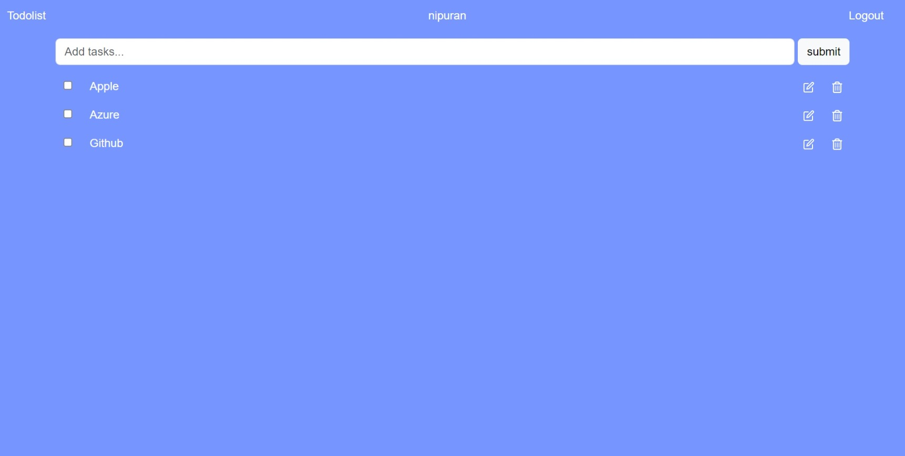

# To-Do List

## Project Overview
A simple to-do list application built with Flask, demonstrating basic CRUD (Create, Read, Update, Delete) operations. This application provides a user-friendly interface for managing tasks effectively.
### Features
- **User Authentication**: 
  - Secure login, registration, password reset, and OTP verification processes.
- **To-Do List Management**: 
  - An interactive dashboard interface that allows users to create, edit, and delete tasks seamlessly.

## Table of Contents
- [Installation Guide](#installation-guide)
- [Deployed App](#deployed-app)
- [Code Structure](#code-structure)

## Installation Guide
### 1. Clone the Repository
```bash
git clone https://github.com/nipuran/todolist-flask.git
```
### 2. Navigate to the Project Directory
```bash
cd todolist-flask
```
### 3. Create a Virtual Environment
```bash
python -m virtualenv .venv
```
### 4. Activate the Virtual Environment
- **Windows**:
  ```bash
  .venv\Scripts\activate
  ```
- **macOS/Linux**:
  ```bash
  source .venv/bin/activate
  ```
### 5. Install Dependencies
```bash
pip install -r requirements.txt
```
> **Note:** The `requirements.txt` file includes the following packages:
> - [Flask](https://pypi.org/project/Flask/)
> - [Flask-WTF](https://pypi.org/project/Flask-WTF/)
> - [Flask-SQLAlchemy](https://pypi.org/project/Flask-SQLAlchemy/)
> - [Flask-Session](https://pypi.org/project/Flask-Session/)
> - [Flask-Bcrypt](https://pypi.org/project/Flask-Bcrypt/)
> - [Flask-Login](https://pypi.org/project/Flask-Login/)
> - [Flask-Mail](https://pypi.org/project/Flask-Mail/)
### 6. Run the App Locally
To start the Flask app, execute the following command in your terminal:
```bash
python run.py
```

## Deployed App
The [To-Do List app](https://todolist-flask-tqrw.onrender.com/) is deployed to showcase the application interactively.
### Preview


## Code Structure
```
todolist-flask/
├── README.md
├── app
│   ├── __init__.py
│   ├── auth
│   │   ├── __init__.py
│   │   ├── forms.py
│   │   ├── routes.py
│   │   ├── static
│   │   │   └── styles.css
│   │   └── templates
│   │       ├── forget_password.html
│   │       ├── register_user.html
│   │       ├── reset_password.html
│   │       ├── user_login.html
│   │       └── verify_otp.html
│   ├── config.py
│   ├── dashboard
│   │   ├── __init__.py
│   │   ├── routes.py
│   │   ├── static
│   │   │   └── styles.css
│   │   └── templates
│   │       ├── dashboard.html
│   │       └── edit.html
│   ├── extensions.py
│   ├── home
│   │   ├── __init__.py
│   │   ├── routes.py
│   │   ├── static
│   │   │   └── styles.css
│   │   └── templates
│   │       └── home.html
│   ├── models.py
│   └── utils.py
└── run.py
```
